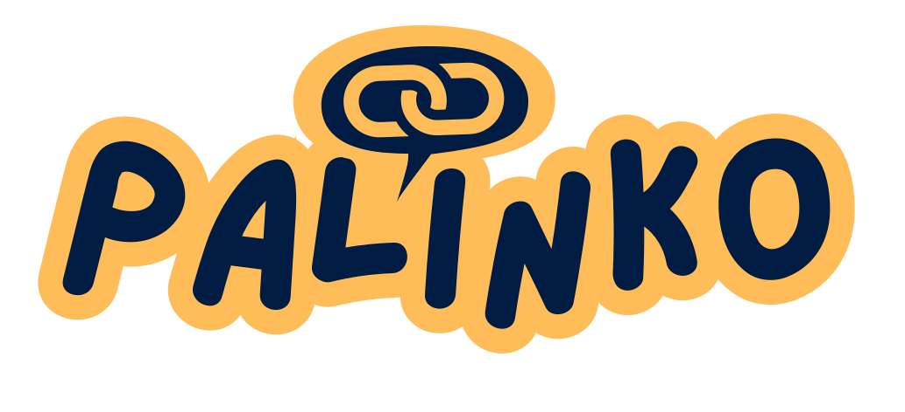

<p align="center">
  
</p>
/ 
<p align="center">
  # https://palinko.onrender.com
  <b>Conecta dos palabras. Encuentra el camino más corto. Que la IA sea juez.</b>
  
</p>

<p align="center">
  
  
  
  
  <br/>
  
  
  
  
  
  <br/>
  
  
  
</p>

## 🇪🇸 Sobre el juego

**PALINKO** es un juego de lógica, creatividad y lenguaje en el que el objetivo es conectar dos palabras
aparentemente inconexas mediante una cadena de palabras relacionadas semánticamente.

A diferencia de otros juegos de palabras, aquí no se trata de adivinar una palabra oculta ni de formar palabras
con letras. El reto consiste en construir el camino más lógico y corto posible entre dos conceptos, demostrando
tu capacidad para encontrar relaciones entre ideas.

### ¿Cómo funciona?

Al comenzar una partida, el juego muestra dos palabras completamente distintas. Por ejemplo:

- Casco → Floristería
- Almendra → WiFi
- Volcán → Teclado
- Delfín → Biblioteca

La misión del jugador es escribir una secuencia de palabras que conecte la primera con la última. Cada palabra
debe mantener una relación lógica con la anterior, formando una cadena de asociaciones coherente:

```
Casco → Motocicleta → Carretera → Ciudad → Parque → Floristería
```

El objetivo no es únicamente llegar al destino, sino hacerlo utilizando el menor número posible de palabras.

### Evaluación mediante Inteligencia Artificial

Cada conexión entre dos palabras consecutivas es evaluada por un modelo de Inteligencia Artificial especializado
en analizar similitud semántica. La IA determina:

- Qué relación existe entre ambas palabras.
- Qué tan fuerte es esa relación.
- Una puntuación de similitud expresada en porcentaje.
- Una breve explicación justificando la puntuación.

Por ejemplo:

> **Motocicleta → Carretera**
> Similitud: 92% — *Las motocicletas circulan habitualmente por carreteras.*

Mientras que una relación más débil como:

> **Motocicleta → Plátano**
> Similitud: 8% — *Comparten muy poca relación conceptual.*

### Puntuación final

La puntuación global de una partida depende de varios factores:

- La calidad de las relaciones entre palabras.
- La coherencia de toda la cadena.
- El número total de palabras utilizadas.
- La precisión media conseguida durante el recorrido.

Generalmente, una cadena más corta y con relaciones fuertes obtendrá una mejor puntuación que una muy larga con
conexiones débiles.

### Creatividad sin una única respuesta correcta

Una de las características más interesantes de PALINKO es que no existe un único camino válido. Dos jugadores
pueden conectar exactamente las mismas palabras utilizando recorridos completamente distintos:

```
Casco → Moto → Gasolinera → Camión → Reparto → Floristería
Casco → Ciclista → Parque → Flores → Floristería
```

Ambos caminos pueden ser correctos si las relaciones entre las palabras tienen sentido. Esto convierte cada
partida en un pequeño ejercicio de creatividad y pensamiento lateral.

### Competición

Los jugadores pueden comparar sus resultados con los de otras personas. Gana quien consiga:

- Resolver el reto utilizando menos palabras.
- Obtener una mayor precisión semántica.
- Encontrar conexiones especialmente ingeniosas.

Cada reto puede tener decenas de soluciones diferentes, lo que aumenta enormemente la rejugabilidad.

### Desafío diario

El juego incluye un reto diario en el que todos los jugadores reciben exactamente las mismas dos palabras
iniciales. Esto permite comparar resultados en igualdad de condiciones y descubrir diferentes formas de resolver
un mismo desafío.

### ¿Qué hace especial a PALINKO?

PALINKO combina elementos de juegos de palabras, creatividad, asociación de conceptos, Inteligencia Artificial y
resolución de problemas. Cada partida es diferente, porque las posibilidades de conexión son prácticamente
ilimitadas. No premia únicamente el conocimiento, sino también la imaginación y la capacidad de encontrar
relaciones que otros jugadores quizá no vean.

El resultado es un juego rápido, intuitivo y muy rejugable, donde cada reto invita a pensar de una forma distinta
y donde la Inteligencia Artificial actúa como juez imparcial, evaluando objetivamente la calidad de cada
conexión.

---

## 🇬🇧 How to play

**PALINKO** is a logic, creativity and language game where the goal is to connect two seemingly unrelated words
through a chain of semantically related words.

Unlike other word games, this isn't about guessing a hidden word or forming words from letters. The challenge is
to build the shortest, most logical path between two concepts, proving your ability to find relationships
between ideas.

### How it works

At the start of a match, the game shows two completely different words, for example:

- Helmet → Flower shop
- Almond → WiFi
- Volcano → Keyboard
- Dolphin → Library

Your mission is to write a sequence of words connecting the first to the last. Each word must hold a logical
relationship with the previous one, forming a coherent chain of associations:

```
Helmet → Motorcycle → Road → City → Park → Flower shop
```

The goal isn't only to reach the destination, but to do it using the fewest possible words.

### AI-powered evaluation

Every connection between two consecutive words is evaluated by an AI model specialized in semantic similarity
analysis. The AI determines:

- What relationship exists between both words.
- How strong that relationship is.
- A similarity score expressed as a percentage.
- A short explanation justifying the score.

For example:

> **Motorcycle → Road**
> Similarity: 92% — *Motorcycles commonly travel on roads.*

While a weaker relation such as:

> **Motorcycle → Banana**
> Similarity: 8% — *They share very little conceptual relation.*

### Final score

A match's overall score depends on several factors: the quality of the relations between words, the coherence of
the whole chain, the total number of words used, and the average accuracy achieved along the way. Generally, a
shorter chain with strong relations scores better than a very long one with weak connections.

### Creativity, no single correct answer

One of the most interesting features of PALINKO is that there is no single valid path — two players can connect
the exact same words through completely different routes, and both can be correct as long as the relationships
make sense. That turns every match into a small exercise in creativity and lateral thinking, with practically
unlimited connection possibilities and near-endless replayability.

### Daily challenge

The game includes a daily challenge where every player gets exactly the same starting pair of words for the day,
so results can be compared on equal footing.

---

## 🧠 Cómo razona la IA / How the AI reasons

Cada palabra enviada pasa por un pipeline antes de aceptarse en la cadena / every submitted word goes through a
pipeline before it's accepted into the chain:

1. **Corrección ortográfica — Hunspell.** El mismo motor que usan LibreOffice y Firefox corrige erratas
   localmente y sin llamadas de red (diccionarios embebidos en `dictionaries/`), un `Hunspell` por idioma cargado
   una vez y reutilizado durante toda la vida de la JVM. Solo corrige errores claros — nunca "inventa" una
   palabra distinta a la que el jugador quiso escribir.
2. **Juicio semántico — LLM con fallback en cadena.** La palabra corregida y la anterior de la cadena se envían
   a un LLM que devuelve JSON estricto con un porcentaje de relación (0-100) y una justificación de una frase.
   - **Groq** (`llama-3.1-8b-instant`) es el proveedor primario — elegido por su latencia baja, crítica porque
     cada envío de palabra bloquea el turno de la partida en vivo.
   - Si Groq falla por cualquier motivo (sin API key, error de red, límite diario de 500 peticiones del free
     tier, JSON malformado), `FallbackWordRelationChecker` reintenta automáticamente contra **OpenRouter**, sin
     que el jugador vea el fallo.
   - Si ambos proveedores fallan, se lanza un error explícito de "no se pudo comparar" en lugar de rechazar la
     palabra silenciosamente como si tuviera 0% de relación — así se distingue "no relacionada" de "no se pudo
     evaluar".
3. **Umbral de aceptación.** Una palabra se acepta si su relación con la anterior supera el
   `RELATEDNESS_THRESHOLD` (40%); si no, se registra como intento rechazado (visible para todos) pero no avanza
   la cadena.
4. **Puntuación.** Un intento aceptado puntúa exactamente el porcentaje de relación devuelto por la IA, más un
   bonus fijo si esa palabra alcanza el objetivo de fase. Un intento rechazado nunca resta puntos, simplemente no
   suma ninguno.

## 🏠 Lógica de salas / Room & round logic

- **Salas en memoria.** Cada `Room` es un agregado de dominio que vive enteramente en memoria (sin base de
  datos) y se descarta al terminar la partida. El ciclo de estados es
  `LOBBY → IN_PROGRESS → FINISHED/CLOSED`, con `resetToLobby` para volver a jugar con el mismo código sin
  recrear la sala.
- **Rol oculto: el infiltrado.** Al arrancar la partida (`Room.start`), el orden de turnos se baraja al azar y
  a un subconjunto de jugadores —como máximo un tercio de la sala (`players.size() / 3`), 0 en salas de menos de
  3 jugadores— se les asigna en secreto el rol de **infiltrado**. Todos ven la misma palabra de inicio, pero el
  grupo persigue una `groupTargetWord` mientras los infiltrados persiguen en secreto una
  `infiltratorTargetWord` distinta, sin que nada en la UI revele en qué grupo está cada uno.
- **Fases encadenadas.** Una partida puede tener varias fases (`RoomSettings.phaseCount`); todas se precalculan
  de una vez al arrancar (`ChainWordBank.fullChain`) para que la cadena completa sea conocida desde el principio.
  Al alcanzar la palabra objetivo de una fase se avanza automáticamente a la siguiente sin resetear turnos ni el
  histórico de intentos.
- **Finales posibles:**
  - **Victoria cooperativa** — si la sala no tiene infiltrados (menos de 3 jugadores), llegar al final de la
    última fase termina la partida directamente en `REVEAL`, sin votación.
  - **Derrota instantánea** — si alguien que *no* es infiltrado escribe por accidente la palabra secreta de los
    infiltrados, la partida termina inmediatamente como derrota para el grupo, saltándose la votación.
  - **Votación final** — al terminar la última fase con infiltrados en juego, se abre la fase `VOTING`: cada
    jugador acusa a quien sospeche (voto libre, puede cambiarse mientras la fase siga abierta). El grupo gana
    solo si hay un único jugador más votado y es realmente un infiltrado; un empate, una acusación equivocada o
    ningún voto favorecen a los infiltrados.
- **Reconexión y limpieza.** Los jugadores desconectados tienen una ventana de gracia para reconectar
  (`game.cleanup.player-reconnect-window-seconds`); el host tiene su propia ventana antes de que la sala se
  cierre por abandono. Una tarea periódica (`RoomCleanupTask`) purga salas vacías, en lobby o finalizadas que
  llevan demasiado tiempo inactivas.
- **Reto diario determinista.** `DailySeed` deriva una semilla estable a partir de la fecha UTC del día y el
  idioma (hash SHA-256), de modo que todos los jugadores que abren el reto diario el mismo día reciben
  exactamente la misma cadena de palabras — es una sala en solitario, no se comparte por código.
- **Rate limiting.** Cada envío de palabra está limitado en ventana corta
  (`game.rate-limit.word-submission.*`) además de un tope diario por sesión, para evitar abuso del LLM.
- **Sincronización en tiempo real.** Salas, turnos, votos y revelaciones se sincronizan entre jugadores vía
  WebSocket/STOMP (`GameStompController`), con REST (`RoomController`) para crear/unirse a salas.

## 📁 Estructura del repositorio

```
guessTheAI/
├── backend/    # Spring Boot API + servidor de juego por WebSocket
└── frontend/   # SPA Vue 3 + Vite
```

Cada proyecto tiene su propio tooling — no hay build a nivel raíz. Entra en el directorio correspondiente antes
de ejecutar los comandos de abajo.

## 🛠️ Stack técnico

**Backend** — `backend/`
- Java 21, Spring Boot 3 (Web, WebSocket/STOMP, Validation, Actuator)
- Arquitectura hexagonal / limpia (`domain` → `application` → `infrastructure`) por slice de funcionalidad
- LLM para juicio semántico: **Groq** (`llama-3.1-8b-instant`) como proveedor primario, con fallback automático
  a **OpenRouter**
- Hunspell (vía bindings JNA) para corrección ortográfica local por idioma
- springdoc-openapi (Swagger UI)
- JUnit 5, Mockito para tests
- Maven (wrapper incluido)
- Docker (`Dockerfile` incluido para despliegue)

**Frontend** — `frontend/`
- Vue 3 (Composition API) + TypeScript
- Vite
- Pinia para gestión de estado
- Vue Router
- Tailwind CSS
- `@stomp/stompjs` + `sockjs-client` para WebSocket/STOMP con el backend
- vue-i18n (inglés/español)
- Axios

## ✅ Requisitos previos

- Java 21 (JDK)
- Maven (o usa el wrapper incluido `mvnw` / `mvnw.cmd` — no hace falta Maven instalado)
- Node.js 18+ (recomendado 20+)
- npm

No se necesita base de datos — el estado de la partida (salas, rondas, jugadores) vive en memoria en el backend.

## 🚀 Puesta en marcha

### 1. Clonar el repositorio

```bash
git clone <url-de-este-repositorio>
cd guessTheAI
```

### 2. Backend

```bash
cd backend
```

La configuración vive en `src/main/resources/application.properties`. Las claves de IA se leen de variables de
entorno (puedes copiar `.env.example` a `.env`):

- `GROQ_API_KEY` — habilita el checker primario (Groq). Sin ella, se usa directamente OpenRouter.
- `OPENROUTER_API_KEY` — habilita el fallback si Groq falla o no está configurado.
- `PORT` — puerto del servidor (por defecto `8080`).
- `APP_CORS_ALLOWED_ORIGINS` — orígenes permitidos para CORS.

Ejecutar el backend:

```bash
# Windows
mvnw.cmd spring-boot:run

# macOS/Linux
./mvnw spring-boot:run
```

La API arranca en `http://localhost:8080` y expone:
- Endpoints REST/WebSocket bajo `/ws` (STOMP sobre SockJS)
- Swagger UI en `http://localhost:8080/swagger-ui/index.html`

Otros comandos útiles (desde `backend/`):

```bash
# Solo compilar
./mvnw compile

# Build completo
./mvnw clean install

# Suite de tests completa
./mvnw test

# Un test concreto
./mvnw test -Dtest=GameApplicationServiceTest

# Un método de test concreto
./mvnw test -Dtest=RoundTest#testMethodName
```

En Windows, sustituye `./mvnw` por `mvnw.cmd`.

### 3. Frontend

```bash
cd frontend
npm install
```

El frontend habla con el backend mediante dos variables de entorno, ya configuradas para desarrollo local en
`.env.development`:

```
VITE_API_BASE_URL=http://localhost:8080
VITE_WS_URL=http://localhost:8080/ws
```

Si necesitas apuntar el frontend a otro backend (por ejemplo, un túnel de Cloudflare para probar con amigos en
remoto), copia `.env.development.local.example` a `.env.development.local` y edita ahí las URLs — este archivo
está en `.gitignore` y sobreescribe `.env.development`.

Arrancar el servidor de desarrollo:

```bash
npm run dev
```

La app estará disponible en la URL que imprima Vite (normalmente `http://localhost:5173`).

Otros comandos útiles:

```bash
# Type-check + build de producción
npm run build

# Previsualizar un build de producción
npm run preview

# Lint (auto-fix)
npm run lint

# Formatear
npm run format
```

### 4. Jugar

Con el backend (`:8080`) y el frontend (`:5173`) corriendo, abre la URL del frontend en el navegador, crea una
sala y comparte el código con tus amigos para que se unan desde sus propios navegadores.

## ▶️ Ejecutar todo junto

No hay un único comando para levantar ambos servicios — ejecuta cada uno en su propia terminal:

```bash
# Terminal 1
cd backend && ./mvnw spring-boot:run

# Terminal 2
cd frontend && npm run dev
```

## 🧪 Testing

- Backend: `cd backend && ./mvnw test` (JUnit 5 + Mockito, sin servicios externos necesarios)
- Frontend: el type-checking corre como parte de `npm run build` (`vue-tsc --build`)

## 🐳 Docker

El backend incluye un `Dockerfile` listo para desplegar (por ejemplo en Render u otro PaaS compatible con
contenedores). El JVM heap está limitado para funcionar en instancias de bajos recursos.

---

<p align="center">
  
</p>
